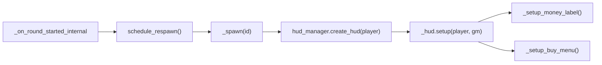

# Анализ багов системы оружия и экономики

## Баг 1: Label с деньгами дублируется после каждого раунда

**Корневая причина:** `GameHUD.setup()` вызывается повторно при каждом респавне, но не очищает ранее созданные UI-элементы.

Цепочка вызовов при каждом старте раунда:




В `hud_manager.gd`, если HUD уже существует, `setup()` вызывается повторно:

```23:26:c:\Users\Maksim\Documents\GitHub\GoonStrike\scripts\ui\hud\hud_manager.gd
	if _hud != null:
		_local_player_id = player.remote_player_id
		_hud.setup(player, gm)
		return
```

`_setup_money_label()` в `game_hud.gd` каждый раз создает **новый** Label, не удаляя старый:

```194:212:c:\Users\Maksim\Documents\GitHub\GoonStrike\scripts\ui\hud\game_hud.gd
func _setup_money_label() -> void:
	if _game_manager == null or not _game_manager.is_economy_mode():
		return
	_money_label = Label.new()
	# ... настройка ...
	add_child(_money_label)
```

Переменная `_money_label` просто перезаписывается -- старый Label остается в дереве сцены как "сирота". `_update_money_hud()` обновляет только последний, а старые показывают устаревшие значения (деньги до начисления бонуса за раунд). Именно поэтому видно наложение -- это не label другого игрока, а предыдущая копия своего же.

**Та же проблема с BuyMenu:**

```188:191:c:\Users\Maksim\Documents\GitHub\GoonStrike\scripts\ui\hud\game_hud.gd
func _setup_buy_menu() -> void:
	_buy_menu = BUY_MENU_SCENE.instantiate() as BuyMenu
	add_child(_buy_menu)
	_buy_menu.setup(_game_manager)
```

Каждый респавн создает новый BuyMenu поверх старого. К тому же, каждый BuyMenu подключается к `money_changed` -- утечка соединений сигналов.

**Исправление:** добавить в начало `_setup_money_label()` и `_setup_buy_menu()` проверку и удаление существующего узла:

```gdscript
func _setup_money_label() -> void:
	if _money_label != null:
		_money_label.queue_free()
		_money_label = null
	# ... далее без изменений

func _setup_buy_menu() -> void:
	if _buy_menu != null:
		_buy_menu.queue_free()
		_buy_menu = null
	# ... далее без изменений
```

---

## Баг 2: Оружие скользит по земле вместо "выкидывания"

**Корневая причина:** `_compute_safe_drop_spawn()` привязывает позицию дропа к полу (0.06 ед. над полом), но при этом задает горизонтальную скорость.

```586:607:c:\Users\Maksim\Documents\GitHub\GoonStrike\scripts\game\game_manager.gd
	var down_from := drop_pos + Vector3.UP * 0.35
	var down_to := drop_pos + Vector3.DOWN * 3.0
	// ...
	if not floor_hit.is_empty():
		var fp: Vector3 = floor_hit.get("position", Vector3.ZERO) as Vector3
		drop_pos.y = fp.y + 0.06  # <-- оружие спавнится почти НА полу
	var linear_vel := Vector3.ZERO
	if wall_hit:
		linear_vel = Vector3.UP * 0.3
	else:
		linear_vel = forward * 1.8 + Vector3.UP * 0.6  # <-- горизонтальная + слабая вертикальная скорость
```

Результат: RigidBody3D мгновенно касается пола и скользит, вместо того чтобы лететь по дуге.

Дополнительно: в `pickup_scene.tscn` нет `PhysicsMaterial` -- используются дефолтные значения (friction = 1.0, bounce = 0.0), что усиливает "прилипание" к полу.

**Исправление:**

- Убрать привязку к полу в `_compute_safe_drop_spawn()`. Спавнить оружие на уровне рук/груди игрока (примерно +1.0..+1.2 от global_position), чтобы оно летело по дуге и падало вниз.
- Увеличить вертикальную составляющую скорости.
- Добавить `PhysicsMaterial` в `pickup_scene.tscn` с разумным bounce (~~0.15) и уменьшенным friction (~~0.4), чтобы оружие не "залипало" при касании пола.

Примерные изменения в `_compute_safe_drop_spawn`:

```gdscript
# Позиция выброса -- уровень рук, а не пол
var drop_pos: Vector3 = start + forward * DROP_FORWARD_OFFSET + Vector3.UP * DROP_UP_OFFSET
# Не привязываем к полу -- пусть физика (гравитация) сработает сама

# Скорость выброса -- больше вертикальной составляющей для дуги
linear_vel = forward * 3.0 + Vector3.UP * 2.0
```

---

## Баг 3: Оружие подбирается только кнопкой действия, а не при наступании

**Корневая причина:** `WeaponPickup` не имеет `Area3D` -- подбор возможен исключительно через `server_request_use_pickup` (raycast по прицелу при нажатии "use").

Сцена пикапа (`pickup_scene.tscn`) содержит только `RigidBody3D` с `CollisionShape3D`, без `Area3D`:

```8:17:c:\Users\Maksim\Documents\GitHub\GoonStrike\scenes\weapons\pickup_scene.tscn
[node name="PickupScene" type="RigidBody3D" ...]
[node name="PhysicsShape" type="CollisionShape3D" parent="."]
[node name="VisualRoot" type="Node3D" parent="."]
[node name="Label3D" type="Label3D" parent="."]
```

Флаг `auto_pickup_if_slot_empty` существует, но используется только внутри `_server_handle_primary_pickup`, куда можно попасть лишь через raycast:

```495:501:c:\Users\Maksim\Documents\GitHub\GoonStrike\scripts\game\game_manager.gd
	if has_weapon:
		if not requested_via_use or not pickup.use_to_swap_if_slot_busy:
			return false
	else:
		if not pickup.auto_pickup_if_slot_empty and not requested_via_use:
			return false
```

**Исправление:**

- Добавить `Area3D` + `CollisionShape3D` (сфера радиусом ~1.0-1.5м) в `pickup_scene.tscn` как дочерний узел пикапа.
- В `weapon_pickup.gd` подключить `body_entered` сигнал Area3D. При входе `OnlinePlayer` в зону -- вызывать серверный подбор через `GameManager._server_handle_primary_pickup(player, self, false)` (параметр `requested_via_use = false`, чтобы свопа не было -- только автоподбор в пустой слот).
- На сервере проверять `auto_pickup_if_slot_empty` -- если слот занят, не подбирать автоматически (только по кнопке "use").

---

## Дополнительные проблемы

### 4. Утечка соединений `money_changed` при пересоздании BuyMenu

Каждый новый BuyMenu подключает `_game_manager.money_changed.connect(_on_money_changed)`. Старый BuyMenu (который не удален из дерева) сохраняет свое подключение. Решается исправлением бага 1 (удаление старого BuyMenu перед созданием нового).

### 5. `_connect_score_signals_if_needed` -- двойное подключение ffa/team сигналов

`_score_signals_ok` не сбрасывается при повторном `setup()`, поэтому сигналы `ffa_score_changed` / `team_score_changed` не дублируются. Но если `game_mode` сменится (маловероятно в текущем коде), защита не сработает. Стоит добавить `_disconnect_score_signals()` в начало `setup()`.

### 6. `continuous_cd = 1` в pickup_scene.tscn без необходимости

Continuous collision detection включен для пикапов, что создает лишнюю нагрузку. Пикапы -- крупные объекты с малой скоростью, CCD им не нужен.