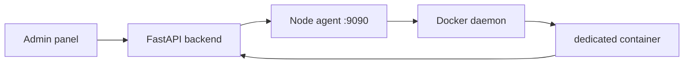

# VDS deploy: оркестратор dedicated-контейнеров

Цель: с **админ-панели / API** поднимать новые игровые сервера на Ubuntu VDS **без ручного SSH** каждый раз. Игровой процесс по-прежнему в **Godot dedicated**; оркестратор только запускает `docker run` с нужными переменными окружения.

Общий контекст репозитория и правила авторитетности матча — см. [AGENTS.md](../AGENTS.md). Сценарий dedicated + backend — см. [dedicated_server.md](dedicated_server.md).

## Архитектура (один хост)



1. В **admin-panel** секция **VDS orchestrator** вызывает **`POST /servers/admin/orchestrator/spawn`** (или тот же API вручную).
2. Backend минтует **одноразовый enrollment token**, привязанный к `server_id`.
3. Backend по **приватному HTTP** дергает агент на VDS: «запусти контейнер с этим токеном и портом».
4. Контейнер стартует с `GOONSTRIKE_BACKEND_URL`, `GOONSTRIKE_REGISTRY_ENROLL_TOKEN`, `GOONSTRIKE_SERVER_ID`, портом и т.д.; `server_bootstrap` делает enroll и сохраняет ключи в `user://` внутри контейнера.

Агент **не** должен быть доступен из интернета. Типично:

- `127.0.0.1:9090` на хосте и backend в той же Docker-сети как `http://orchestrator:9090`, или
- только WireGuard/Tailscale между машинами, если backend и agent на разных узлах.

## Что уже есть в репозитории

| Компонент | Путь |
|-----------|------|
| Node agent (FastAPI + `docker run`) | `orchestrator/agent/` |
| Backend: спавн | `POST /servers/admin/orchestrator/spawn` |
| Корневой Compose (postgres, backend, admin-panel, **orchestrator**) | `docker-compose.yml` |
| Подсказки для merge на VDS | `docker-compose.vds.example.yml` |
| Dedicated image Dockerfile | `orchestrator/dedicated.Dockerfile.example` |

В **`docker-compose.yml`** сервис `orchestrator` уже описан: сокет Docker смонтирован, порт **`127.0.0.1:9090:9090`**. Чтобы спавн и прокси из backend работали, в окружении хоста (или `.env` в корне репозитория) должны быть заданы **`GOONSTRIKE_ORCHESTRATOR_SECRET`** и при необходимости **`GOONSTRIKE_PUBLIC_BACKEND_URL`**. Backend по умолчанию получает `GOONSTRIKE_ORCHESTRATOR_URL=http://orchestrator:9090` из Compose — этого достаточно, когда backend и agent в одной Docker-сети.

Переменные backend (префикс `GOONSTRIKE_`, см. `backend/app/config.py`):

- `GOONSTRIKE_ORCHESTRATOR_URL` — URL агента (в Compose: `http://orchestrator:9090`).
- `GOONSTRIKE_ORCHESTRATOR_SECRET` — **обязательный общий секрет** с агентом; без него backend вернёт 503 на оркестраторные вызовы, агент — 401/503.
- `GOONSTRIKE_PUBLIC_BACKEND_URL` — URL API **как его видит контейнер dedicated** (часто публичный `https://api.example.com` или `http://ВАШ_IP:8000`). Если не задан, его нужно передать в теле `spawn` как `backend_url`, иначе backend отклонит запрос.
- `GOONSTRIKE_ORCHESTRATOR_DEFAULT_IMAGE` — тег образа dedicated для спавна (по умолчанию `goonstrike-dedicated:latest`).

Агент (`orchestrator/agent/main.py`):

- `GOONSTRIKE_ORCHESTRATOR_SECRET` (или совместимое `GOONSTRIKE_AGENT_TOKEN`) — **то же значение**, что у backend.
- `GOONSTRIKE_DEFAULT_IMAGE` — образ dedicated (в Compose: `GOONSTRIKE_ORCHESTRATOR_DEFAULT_IMAGE`).

## Образ dedicated

Репозиторий теперь содержит рабочий пример образа в `orchestrator/dedicated.Dockerfile.example`:

- скачивает headless Godot `4.6.1`;
- копирует проект;
- запускает `scenes/server/server_bootstrap.tscn` через `orchestrator/dedicated.entrypoint.sh`.

Сборка с корня репозитория:

```bash
docker build -f orchestrator/dedicated.Dockerfile.example -t goonstrike-dedicated:latest .
```

Smoke-check:

```bash
docker run --rm -e GOONSTRIKE_DEDICATED_PORT=7999 goonstrike-dedicated:latest
```

Для production лучше переехать на CI-экспорт артефактов (PCK/бандл) и копировать именно export-выход, но для VDS MVP этого Dockerfile достаточно.

## Пример вызова spawn

```powershell
$body = @{
  port        = 7001
  server_id   = "eu-1-7001"
  map_id      = "default"
  mode_id     = "team_elim"
  backend_url = "http://203.0.113.10:8000"
  public_host = "203.0.113.10"
} | ConvertTo-Json

Invoke-RestMethod -Method Post -Uri http://127.0.0.1:8000/servers/admin/orchestrator/spawn `
  -Headers @{ "X-GS-Admin-Token" = "..."; "Content-Type" = "application/json" } `
  -Body $body
```

`public_host` попадает в `GOONSTRIKE_PUBLIC_HOST` в контейнере — так в браузере списка серверов будет правильный адрес для клиентов.

Удалить инстанс на стороне агента:

```bash
curl -X DELETE -H "X-GS-Agent-Token: $SECRET" http://127.0.0.1:9090/v1/instances/7001
```

Посмотреть статус инстанса и хвост логов на стороне backend-прокси:

```bash
curl -H "X-GS-Admin-Token: $ADMIN" http://127.0.0.1:8000/servers/admin/orchestrator/instances/7001
curl -H "X-GS-Admin-Token: $ADMIN" "http://127.0.0.1:8000/servers/admin/orchestrator/instances/7001/logs?tail=200"
```

## Безопасность

- Разные роли: **`GOONSTRIKE_REGISTRY_ADMIN_TOKEN`** (панель и `POST /servers/admin/*`) ≠ **`GOONSTRIKE_ORCHESTRATOR_SECRET`** (только backend → agent).
- Enrollment токен одноразовый и короткий — его при спавне формирует backend и передаёт агенту в теле `POST /v1/instances`; не храните его в открытом виде вне защищённых каналов.
- Не публикуй порт агента (9090) в интернет; в Compose он привязан к localhost на хосте — для удалённого backend используйте VPN/приватную сеть или туннель.

## Когда нужен Kubernetes / Nomad

Один VDS + Docker достаточно для прототипа. Отдельный оркестратор уровня K8s имеет смысл при многих узлах, автомасштабе и своём networking — до этого проще держать один агент на хосте и вызывать spawn из backend.
